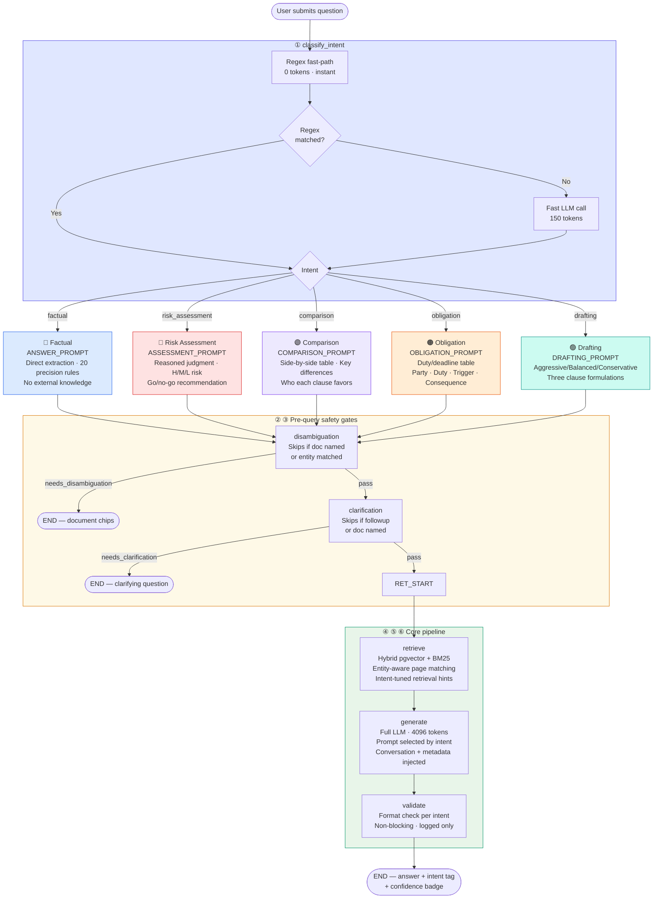

# Agent Flow: Intent Classifier (LangGraph)

Technical deep-dive into the query-pipeline agent implemented in `app/services/intent_agent.py`.

For the broader system context, see `SYSTEM_OVERVIEW.md` and `FLOWCHART.md`.

---

## 1. Overview

Every user question in the Ask tab is orchestrated by a LangGraph `StateGraph` — a directed graph of six nodes with conditional edges. The graph classifies the query from a lawyer's perspective, runs pre-query safety checks (disambiguation, clarification), retrieves wiki context, generates an intent-specific answer, and validates the output format.

Each node emits real-time **stage events** via LangGraph's custom stream writer. Flask relays these as **Server-Sent Events (SSE)** so the chat UI can render animated progress tiles. The graph runs synchronously inside the Flask request thread — no Celery or async needed.

**File:** `app/services/intent_agent.py`
**Framework:** LangGraph 1.0+ (`langgraph.graph.StateGraph`)
**Entry point:** `run_query_stream(question, session_id, target_doc, is_followup)` — yields stage event dicts

---

## 2. Graph Topology



**Conditional edges:**
- After `disambiguation`: if `needs_disambiguation` is true → END (short-circuit). Otherwise → `clarification`.
- After `clarification`: if `needs_clarification` is true → END (short-circuit). Otherwise → `retrieve`.
- All other edges are unconditional.

### Intent → Prompt → Output shape (quick reference)

| Intent | Colour | Prompt template | What it tells the LLM to produce |
|---|---|---|---|
| `factual` | 🔵 Blue | `ANSWER_PROMPT` | Direct answer grounded only in context. 20 precision rules (scope restriction, no external knowledge, arithmetic prohibition, legal standard precision, etc.). IEEE citations. |
| `risk_assessment` | 🔴 Red | `ASSESSMENT_PROMPT` | Professional legal judgment permitted. Risk classified as H/M/L with basis. Gaps and missing protections flagged. Concrete recommendations (accept/reject/negotiate). |
| `comparison` | 🟣 Purple | `COMPARISON_PROMPT` | Side-by-side markdown table (rows = aspects, columns = documents). Key Differences section. Who-it-favors analysis per difference. "Not addressed" for missing clauses. |
| `obligation` | 🟠 Orange | `OBLIGATION_PROMPT` | Duty/deadline table (Obligated Party · Duty · Deadline/Trigger · Consequence · Source Clause). Priority Deadlines chronological list. Direction of obligation preserved. |
| `drafting` | 🟢 Teal | `DRAFTING_PROMPT` | Three labelled formulations: Aggressive (favors client), Balanced (market-standard), Conservative (low-risk). Legal implications per formulation. Grounded in existing contract language. |

---

## 3. Graph State (`QueryState`)

A `TypedDict` carried through every node. Each node reads what it needs and writes its outputs back.

```python
class QueryState(TypedDict, total=False):
    # ── Input (set by run_query_stream before graph starts) ──
    question: str              # The user's raw question text
    session_id: str            # Wiki session UUID
    target_doc: str            # Force-scoped document (from disambiguation chip click)
    is_followup: bool          # True when user responded to a prior clarification

    # ── Set by classify_intent node ──
    intent: str                # "factual" | "risk_assessment" | "comparison" | "obligation" | "drafting"
    intent_confidence: float   # 0.0–1.0
    intent_method: str         # "regex" | "llm" | "fallback" | "disabled"

    # ── Set by disambiguation / clarification nodes ──
    needs_disambiguation: bool
    disambiguation_data: dict  # {message, documents, raw_documents}
    needs_clarification: bool
    clarification_data: dict   # {message, options, original_question}

    # ── Set by retrieve / generate / validate nodes ──
    conversation_context: str  # Last 3–5 chat messages, max ~2000 chars
    wiki_context: str          # Formatted "## Title\ncontent" string
    selected_titles: list      # Page titles included in context
    retrieval_meta: dict       # {bm25_count, page_selection_usage}
    answer_result: dict        # Full generate_answer() return + intent fields
    validation: dict           # {valid: bool, warning: str|None}
```

---

## 4. Nodes — Detailed Walkthrough

### 4.1 `classify_intent` — Intent Classification

**Purpose:** Determine what kind of legal task the user is asking for.

**SSE events emitted:**
1. `{stage: "classifying", status: "active", message: "Classifying intent…"}`
2. `{stage: "intent_identified", status: "done", intent, intent_label, intent_confidence, intent_method}`

**Logic (two-tier):**

**Tier 1 — Regex fast-path (0 tokens, <1ms):**
Checked in priority order. First match wins.

| Priority | Pattern | Intent | Example triggers |
|---|---|---|---|
| 1 | `_RX_DRAFTING` | `drafting` | "draft", "redline", "rewrite", "suggest language", "counter-proposal", "alternative wording" |
| 2 | `_RX_COMPARISON` | `comparison` | "compare", "differ", "versus", "vs", "side by side", "contrast" |
| 2b | `_RX_BETWEEN` | `comparison` | "between X and Y" (any context) |
| 3 | `_RX_RISK` | `risk_assessment` | "go/no-go", "recommend", "should we sign", "risk assessment", "red flag", "deal-breaker", "safe to sign", "negotiation strategy" |
| 4 | `_RX_OBLIGATION` | `obligation` | "what are our obligations", "list the deadlines", "comply with", "compliance requirements", "required to", "must we" |

**Design note:** The obligation regex was tightened to avoid false positives. A phrase like "return/destruction obligation" (naming an NDA section) does NOT trigger obligation intent — only phrases where obligation is the *subject* of the query match.

**Tier 2 — LLM fallback (150 tokens, ~300ms):**
If no regex matches and `ENABLE_INTENT_CLASSIFIER` is true, a fast-model LLM call classifies the query:

```
Prompt: "You classify a lawyer's question into exactly ONE intent.
Intents: factual, risk_assessment, comparison, obligation, drafting.
Question: {question}
Respond with JSON only: {"intent": "slug", "confidence": 0.0-1.0}"
```

- Model: fast tier (`AZURE_FAST_DEPLOYMENT` / `OPENROUTER_FAST_MODEL`)
- Max tokens: `MAX_TOKENS_INTENT_CLASSIFY` (150)
- Parse: `_parse_json_safe()` → validate intent slug ∈ `VALID_INTENTS`

**Fallback:** Any failure (LLM error, parse error, invalid intent) → `{"intent": "factual", "confidence": 0.5, "method": "fallback"}`. This guarantees the graph never crashes on classification — worst case is a generic factual answer.

**State written:** `intent`, `intent_confidence`, `intent_method`

---

### 4.2 `disambiguation` — Document Scope Check

**Purpose:** If the question references no specific document, ask the user which document they mean.

**SSE events emitted (only when check runs):**
1. `{stage: "disambiguation", status: "active", message: "Checking document scope…"}`
2. If needed: `{stage: "disambiguation", status: "done", type: "disambiguation", payload: {message, documents, raw_documents}}`

**Skip conditions (any → skip):**
- `target_doc` is set (user already picked a document)
- `is_followup` is true (user responded to a prior prompt)
- `_question_names_a_document()` matches (3 layers):
  1. Numbered pattern: "service agreement 1", "NDA 3", "SA1"
  2. Entity + doc type: "ReVolt JV Agreement", "Meridian service agreement"
  3. Known entity from page titles: distinctive capitalized names extracted from wiki page titles

**When it runs:**
Calls `wiki.classify_query(question, session_id)` which:
1. Checks `_detect_mentioned_files()` (filename matching)
2. Checks `_question_mentions_known_entity()` (entity matching against page titles)
3. Falls back to a fast LLM call asking if the question uses vague references ("this document", "summarize it")

**If disambiguation needed:** Sets `needs_disambiguation = True`, emits the disambiguation event with document list, and the conditional edge routes to END. The frontend renders clickable document chips.

**State written:** `needs_disambiguation`, `disambiguation_data`

---

### 4.3 `clarification` — Ambiguity Check

**Purpose:** If the question is too ambiguous, ask one clarifying question before answering.

**SSE events emitted (only when check runs):**
1. `{stage: "clarification", status: "active", message: "Checking for ambiguity…"}`
2. If needed: `{stage: "clarification", status: "done", type: "clarification", payload: {message, options}}`

**Skip conditions (any → skip):**
- `is_followup` is true
- `_question_names_a_document()` matches
- `ENABLE_CLARIFICATION` is false

**When it runs:**
Calls `wiki.check_ambiguity(question, session_id, conversation_context)` — fast LLM call that determines if the question could mean multiple very different things.

**Hard limit:** 1 clarification per turn. After the user responds (is_followup=true), this check is permanently skipped.

**Also sets:** `conversation_context` (fetched from chat_messages table via `build_conversation_context()`)

**State written:** `needs_clarification`, `clarification_data`, `conversation_context`

---

### 4.4 `retrieve` — Context Retrieval

**Purpose:** Select relevant wiki pages and format them as context for the answer LLM.

**SSE events emitted:**
1. `{stage: "retrieving", status: "active", message: "Retrieving relevant pages…"}`
2. `{stage: "pages_retrieved", status: "done", count: N, message: "Retrieved N page(s)"}`

**Logic:**
1. Calls `get_query_strategy(intent)` for retrieval hints:
   - `comparison` → `{multi_doc: true, small_wiki_threshold: 30}` (widens the net)
   - `obligation` → `{keyword_boost: ["shall", "must", "obligation", …]}`
   - `drafting` → `{keyword_boost: ["definition", "clause", "shall", …]}`
   - `factual` / `risk_assessment` → `{}` (default retrieval)

2. Calls `wiki.get_context(question, session_id, target_doc, retrieval_hints)` which runs:
   - **Document detection** (3 layers): filename matching → entity matching → target_doc
   - **Page selection** (3-path cascade): hybrid pgvector+BM25 → BM25+LLM → BM25-only
   - **Context formatting**: cap pages at 2000 chars, prepend contradiction warnings

**State written:** `wiki_context`, `selected_titles`, `retrieval_meta`, `conversation_context`

---

### 4.5 `generate` — Answer Generation

**Purpose:** Call the full-power LLM with an intent-specific prompt template to produce the answer.

**SSE events emitted:**
1. `{stage: "generating", status: "active", intent, prompt_type, message: "Generating {intent} answer…"}`

**Prompt selection:**

| Intent | Prompt template | Output shape |
|---|---|---|
| `factual` | `ANSWER_PROMPT` | Direct answer with 20+ precision rules, IEEE citations |
| `risk_assessment` | `ASSESSMENT_PROMPT` | Reasoned judgment, H/M/L risk classification, go/no-go recommendation |
| `comparison` | `COMPARISON_PROMPT` | Side-by-side markdown table, key differences, who-it-favors analysis |
| `obligation` | `OBLIGATION_PROMPT` | Duty/deadline table (party · duty · trigger · consequence · clause) |
| `drafting` | `DRAFTING_PROMPT` | Three formulations (aggressive/balanced/conservative) with implications |

All prompts include: `{conversation_block}`, `{metadata_block}`, `{context}`, `{question}`.
All require `<reasoning>` block with `CONFIDENCE_SCORE` and `CONFIDENCE_REASON`.

**Post-LLM processing** (inside `wiki.generate_answer()`):
- Extract confidence via tolerant regex (handles unclosed tags, unicode, whitespace)
- Strip `<reasoning>` block from user-facing answer
- Short "not covered" → force confidence to 0

**Enrichment:** After `wiki.generate_answer()` returns, the node adds `intent`, `intent_label`, `intent_confidence`, `intent_method` to the result dict.

**State written:** `answer_result`

---

### 4.6 `validate` — Response Format Check

**Purpose:** Light sanity check — does the answer match the expected format for the classified intent?

**SSE events emitted:**
1. `{stage: "complete", status: "done", type: "answer", payload: {full answer result}, message: "Done"}`

**Checks per intent:**

| Intent | Validation rule | What triggers a warning |
|---|---|---|
| `comparison` | Answer contains `\|` (table pipe) | No comparison table detected |
| `obligation` | Answer contains `\|` or list markers (`-`, `*`, numbered) | No list or table detected |
| `drafting` | Answer contains `` ``` `` or `>` or "aggressive"/"balanced"/"conservative" | No clause formulations detected |
| `factual` / `risk_assessment` | No check | — |

**Non-blocking:** Warnings are logged (`logger.info`) but the answer is still returned to the user. The validation never blocks or retries.

**State written:** `answer_result.validation`, `validation`

---

## 5. SSE Event Stream

`app.py` iterates over `run_query_stream()` and wraps each event as SSE:

```
data: {"stage": "classifying", "status": "active", "message": "Classifying intent…"}

data: {"stage": "intent_identified", "status": "done", "intent": "comparison", ...}

data: {"stage": "retrieving", "status": "active", "message": "Retrieving relevant pages…"}

data: {"stage": "pages_retrieved", "status": "done", "count": 15, ...}

data: {"stage": "generating", "status": "active", "message": "Generating comparison answer…"}

data: {"type": "answer", "wiki": {"answer": "...", "intent": "comparison", "intent_label": "Comparison", "confidence_score": 92, ...}}
```

**Terminal events** (exactly one per request):
- `{type: "answer", wiki: {...}}` — full answer with intent metadata
- `{type: "disambiguation", message, documents, raw_documents}` — user must pick a document
- `{type: "clarification", message, options}` — user must clarify the question
- `{type: "error", error: "..."}` — pipeline failure

The frontend reads the stream via `ReadableStream.getReader()`, renders animated stage tiles (spinner → checkmark), then replaces them with the answer card carrying a coloured intent badge.

---

## 6. Tools / Services Called by Nodes

| Node | Service calls | Model tier | Token budget |
|---|---|---|---|
| `classify_intent` | `llm.ask(fast=True)` (only if regex misses) | Fast | 150 |
| `disambiguation` | `wiki.classify_query()` → `llm.ask(fast=True)` | Fast | 200 |
| `clarification` | `wiki.check_ambiguity()` → `llm.ask(fast=True)` | Fast | 300 |
| `retrieve` | `wiki.get_context()` → `embedder.embed()` + `db.search_similar_pages()` + BM25 | — | 0 (hybrid) or 1000 (LLM fallback) |
| `generate` | `wiki.generate_answer()` → `llm.ask(fast=False)` | Full | 4096 |
| `validate` | Pure Python (regex checks) | — | 0 |

**Total worst-case token budget per query:** 150 + 200 + 300 + 1000 + 4096 = **5,746 tokens**
**Typical token budget (regex intent, hybrid retrieval):** 200 + 300 + 4096 = **4,596 tokens** (disambiguation + clarification may not fire)

---

## 7. Graph Compilation & Caching

```python
_QUERY_GRAPH = None

def get_query_graph():
    global _QUERY_GRAPH
    if _QUERY_GRAPH is None:
        _QUERY_GRAPH = build_query_graph()
    return _QUERY_GRAPH
```

The graph is compiled once on first request and cached globally. `build_query_graph()` constructs the `StateGraph`, adds all nodes and edges, and calls `.compile()`. Subsequent requests reuse the compiled graph — no re-compilation overhead.

---

## 8. Debug Logging

Every node logs entry and key decisions at `INFO` level with `[AGENT]` prefix:

```
[AGENT] classify_intent_node: question='Compare indemnity in SA1 vs SA2'
[AGENT] intent=comparison conf=0.90 method=regex
[AGENT] check_disambiguation_node
[AGENT] disambiguation skipped (doc named or followup)
[AGENT] retrieve_context_node: intent=comparison
[AGENT] generate_answer_node: intent=comparison pages=14
[AGENT] validate_response_node: intent=comparison
```

`app.py` additionally logs each SSE event:
```
SSE stage: classifying | Classifying intent…
SSE stage: intent_identified | Intent: Comparison
SSE stage: retrieving | Retrieving relevant pages…
SSE stage: pages_retrieved | Retrieved 14 page(s)
SSE stage: generating | Generating comparison answer…
SSE answer: intent=comparison conf=92%
```

---

## 9. Failure Modes & Graceful Degradation

| Failure | Behaviour |
|---|---|
| Intent LLM call returns 429 / error | Falls back to `factual` intent (safest default) |
| Intent LLM returns invalid JSON | Falls back to `factual` |
| Disambiguation LLM fails | Skips disambiguation, proceeds to clarification |
| Clarification LLM fails | Skips clarification, proceeds to retrieval |
| `generate_answer()` throws exception | Returns error message as the answer with confidence 0 |
| Validate finds format mismatch | Logs warning, returns the answer anyway |
| `_emit()` fails (no stream writer) | Silently skipped — answer still produced, just no SSE tiles |

The graph never crashes. Every node has try/except with a safe fallback. The worst case is a generic factual answer with no progress tiles — functionally identical to the pre-agent system.
