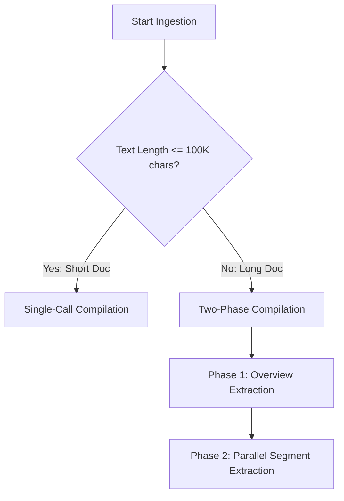
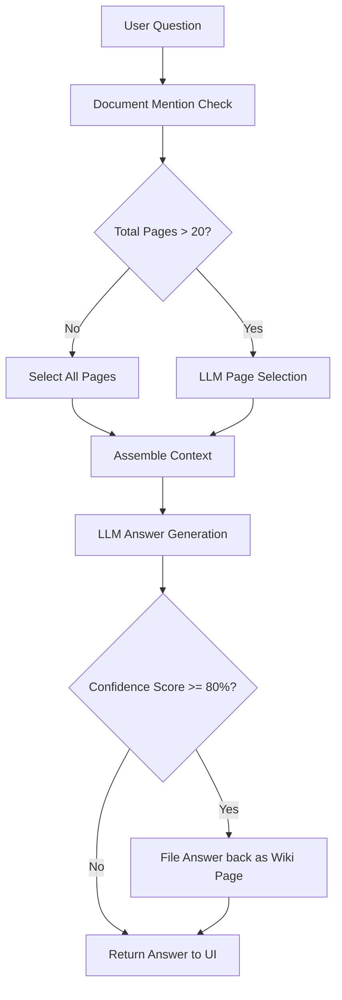
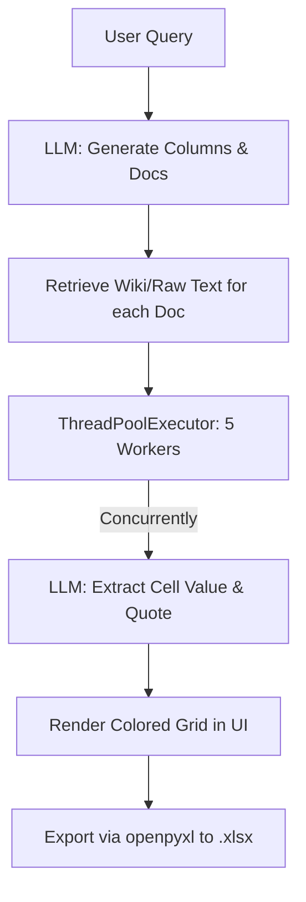

# Legal LLM Wiki: Detailed System Flow Documentation

This document provides a comprehensive, step-by-step technical breakdown of the entire **Legal LLM Wiki** system. It details the life cycle of a document from initial ingestion to query answering, outlining exactly what is sent to the Large Language Model (LLM), the expected JSON responses, and how knowledge is structured, merged, and updated in the persistent wiki.

---

## 1. Ingestion Pipeline ("The Compiler")

The ingestion pipeline converts raw unstructured legal documents (PDFs and TXT files) into a structured, relational knowledge base.

### Step 1.1: Upload and Queueing
1. **Endpoint**: `POST /upload` in [app.py](file:///c:/Users/Rhea/Desktop/Tasks/Legal-wiki-RAG/app/app.py#L120-L206)
2. **Inputs**:
   - `file`: One or more files.
   - `session_id`: Unique identifier for the active session (automatically generated if not provided).
   - `relative_paths`: An optional JSON array representing folder paths for nested folder uploads (e.g., `["NDA/Tata_NDA.pdf"]`).
3. **Storage**: Files are saved to `data/uploads/` with the filename format: `{session_id}_{safe_relative_path}` (e.g., `24b74788_NDA_Tata_NDA.pdf`).
4. **Queueing**:
   - An entry is initialized in `config.PROGRESS_STORE[session_id]` to track the total document count and pipeline completion.
   - Ingestion tasks are submitted to a global `ThreadPoolExecutor` for concurrent background processing.
   - **Response**: The Flask server immediately returns a non-blocking `{"status": "accepted", "files_queued": N}`. The client frontend polls `/progress` every 1.5 seconds.

### Step 1.2: Text Extraction & OCR
- **Function**: `read_file` in `services/reader.py` (triggered by [_ingest_single_doc_wiki](file:///c:/Users/Rhea/Desktop/Tasks/Legal-wiki-RAG/app/app.py#L224-L235)).
- **Text Files**: Read directly with UTF-8 encoding.
- **PDF Files**: Text is extracted using `pdfplumber`. If a PDF contains scanned pages or images (no extractable text), the reader falls back to **Tesseract OCR** (configured via `TESSERACT_CMD` in the `.env` file).

### Step 1.3: Adaptive Segmentation
The system chooses an ingestion strategy depending on the length of the extracted text:



#### Strategy A: Short Documents (<= 100K characters)
- **Execution**: The entire text is processed in a single LLM call.
- **What is Sent to the LLM**: The prompt is rendered using `INGEST_PROMPT_TEMPLATE` in [wiki.py](file:///c:/Users/Rhea/Desktop/Tasks/Legal-wiki-RAG/app/services/wiki.py#L286-L331):
  ```
  You are a legal wiki knowledge synthesizer. Read this document and create wiki pages
  that capture its legal meaning, statutory basis, precedents, and judicial reasoning.
  ...
  PAGE TITLES: You MUST append the inferred Document Type in parentheses to EVERY page title.
  DOCUMENT: {text}
  ```
- **LLM Output (Valid JSON)**:
  ```json
  {
    "doc_type": "Non-Disclosure Agreement",
    "pages": {
      "Confidentiality (Non-Disclosure Agreement)": {
        "content": "4-10 sentence detailed synthesis of clauses, limitations, and scope...",
        "summary": "One-line summary of what this page covers.",
        "quotes": ["Exact verbatim quote 1 from source", "Exact verbatim quote 2"]
      }
    },
    "relations": [
      {"from": "Confidentiality (Non-Disclosure Agreement)", "to": "Termination (Non-Disclosure Agreement)", "label": "governed by"}
    ]
  }
  ```

#### Strategy B: Long Documents (> 100K characters)
- **Phase 1: Overview Extraction**
  - **Context**: Read the first 6,000 and last 3,000 characters of the document.
  - **What is Sent to the LLM**: Evaluated using `OVERVIEW_PROMPT_TEMPLATE` in [wiki.py](file:///c:/Users/Rhea/Desktop/Tasks/Legal-wiki-RAG/app/services/wiki.py#L335-L362):
    ```
    Produce:
    1. A "Document Overview" page summarizing the document's purpose, parties, scope, and key themes.
    2. A list of ALL specific topics, provisions, precedents, and legal concepts that should get their own page.
    ```
  - **LLM Output**:
    ```json
    {
      "doc_type": "Master Service Agreement",
      "overview_page": {
        "content": "Detailed 6-12 sentence summary of the agreement...",
        "summary": "One-line summary of the document."
      },
      "topics": ["Payment Terms", "Indemnification", "Intellectual Property"]
    }
    ```
  - **Action**: The overview page is immediately merged into the wiki.

- **Phase 2: Segment Extraction**
  - **Chunking**: The document is split into chunks of 40,000 characters with a 500-character overlap.
  - **Concurrency**: Chunks are processed concurrently using a nested `ThreadPoolExecutor` (capped by `WIKI_MAX_WORKERS` from config).
  - **What is Sent to the LLM**: Formatted using `DETAIL_PROMPT_TEMPLATE` in [wiki.py](file:///c:/Users/Rhea/Desktop/Tasks/Legal-wiki-RAG/app/services/wiki.py#L366-L403), injecting the global `topics` list and `doc_type` from Phase 1:
    ```
    Your job: read this segment and create/update wiki pages for any of the known topics that appear here.
    KNOWN TOPICS: ["Payment Terms", "Indemnification", ...]
    DOCUMENT SEGMENT: {text}
    ```
  - **LLM Output**:
    ```json
    {
      "pages": {
        "Payment Terms (Master Service Agreement)": {
          "content": "Detailed synthesis of payment provisions within this segment...",
          "summary": "One-line summary.",
          "quotes": ["Exact verbatim quotes..."]
        }
      },
      "relations": [
        {"from": "Payment Terms (Master Service Agreement)", "to": "Document Overview (Master Service Agreement)", "label": "part of"}
      ]
    }
    ```

### Step 1.4: Robust JSON Parsing & LLM Repair
- **Parsing**: `_parse_json_safe` trims outer text, locates the outermost brackets `{}` or `[]`, and parses the JSON.
- **Repair**: If parsing fails (due to unescaped quotes or trailing commas), `_repair_json` sends the malformed JSON back to the LLM:
  - *Prompt*: `"The following is malformed JSON. Fix it and return only valid JSON, no explanation: {raw_text}"`
  - If repair fails, it gracefully falls back to an empty scaffold: `{"pages": {}, "relations": []}`.

### Step 1.5: Thread-Safe Atomic Merging (`_atomic_merge`)
To prevent concurrent write corruption, the database load-merge-save cycle is wrapped in a session-specific thread lock (`_get_session_lock(session_id)`).

1. **Load Index**: Loads the current session's `data/wiki/{session_id}/index.json`.
2. **Page Insertion / Appending**:
   - For every new page, quotes are appended to content under a `**Supporting Quotes:**` header.
   - **New Page**: Added directly to the index:
     ```json
     "Title (Doc Type)": {
       "content": "Content...",
       "summary": "Summary...",
       "source_doc": "Filename.pdf"
     }
     ```
   - **Existing Page**:
     - **Contradiction Pre-Flight**: If both existing and new content exceed 200 characters, a mini-LLM call checks for contradictions:
       - *Prompt*: `"Do these two texts contradict each other on any specific factual claim (dates, values, obligations, parties)? Reply JSON only: {"contradicts": bool, "claim": str|null, "value_a": str|null, "value_b": str|null}"`
       - *Action*: If `contradicts` is `true`, the page is flagged as `contradiction_flagged = true`. A `variants` list tracks the historical values and ingestion timestamp per document:
         ```json
         "variants": [
           {
             "source": "Previous Document",
             "value": "Existing page text...",
             "date_ingested": "2026-06-02T10:00:00"
           },
           {
             "source": "New Document",
             "value": "New page text...",
             "date_ingested": "2026-06-02T10:10:00"
           }
         ]
         ```
     - The text is appended using a divider: `existing_content + "\n\n---\n" + new_content`. The summary is updated to the new page's summary, and the flag status is preserved.
3. **Relation Deduplication**: Relations are saved as `{"from": "Title A", "to": "Title B", "label": "rel_name"}`. Duplicate triplets are removed.
4. **Cross-Referencing Pass**: The system runs a programmatic $O(N^2)$ scan. If Page B's title appears in Page A's text content, it automatically creates a relation:
   `{"from": "Page A", "to": "Page B", "label": "mentions"}`.
5. **Persistence & Log**: Saves the updated dictionary to `index.json`, releases the lock, and logs events (e.g. contradictions) to `data/logs/{session_id}_log.md`.

---

## 2. Query Pipeline ("Ask Mode")

Ask Mode answers user questions using synthesized wiki pages, with a feedback loop that saves generated insights back to the wiki.



### Step 2.1: Document Mention Check
- **Function**: `_detect_mentioned_files` in [wiki.py](file:///c:/Users/Rhea/Desktop/Tasks/Legal-wiki-RAG/app/services/wiki.py#L602-L645)
- **Logic**: Scans the user query string for mentions of any document names (e.g., matching the lowercase filename, stripping session UUIDs, replacing underscores with spaces).
- **Behavior**: If file mentions are detected, all wiki pages containing those filenames in their titles are marked as **forced selections** so they remain in the prompt context.

### Step 2.2: Page Selection
If the wiki is small (<= 20 pages), all pages are included. If the wiki is large (> 20 pages):
- **What is Sent to the LLM**: Rendered using `PAGE_SELECT_PROMPT` in [wiki.py](file:///c:/Users/Rhea/Desktop/Tasks/Legal-wiki-RAG/app/services/wiki.py#L663-L678), listing all pages and their summaries:
  ```
  Pick the 15-25 MOST RELEVANT pages for answering this question.
  CRITICAL: If the question is GENERAL, you MUST select relevant pages from ACROSS MULTIPLE DIFFERENT DOCUMENTS.
  WIKI INDEX:
  - Payment Terms (NDA): One-line summary
  - ...
  QUESTION: {question}
  ```
- **LLM Output**: A plain JSON list of titles: `["Payment Terms (NDA)", "Termination (Service Agreement)"]`.

### Step 2.3: Context Compilation
- The contents of the selected pages are retrieved.
- If a page has `contradiction_flagged: true`, a warning is prepended to the page content:
  `[WARNING: This page contains conflicting claims. Surface the conflict explicitly in your answer. Do not resolve it.]`
- The segments are concatenated with header titles: `## Page Title\n{Content}`.

### Step 2.4: Answer Generation
- **What is Sent to the LLM**: Rendered using `ANSWER_PROMPT` in [prompts.py](file:///c:/Users/Rhea/Desktop/Tasks/Legal-wiki-RAG/app/services/prompts.py#L9-L43):
  - *Key prompt instructions*: Force step-by-step reasoning in `<reasoning>` tags first. Synthesize across documents and group approaches. Use IEEE brackets for inline citations (e.g. `[1]`). Construct a trailing `References` list following the format: `[X] File_Name.pdf, Clause/Page | Quote: <exact verbatim quote from the text>`. Do not use external legal assumptions.
- **LLM Output**:
  ```xml
  <reasoning>
  Evaluating context... Found payment cap in Doc A [1] and Doc B [2].
  </reasoning>
  The payment terms require net 30 payment terms [1]. However, in service agreement [2], net 45 is defined.
  
  References
  [1] Tata_NDA.pdf, Clause 4.2 | Quote: Payment shall be completed in net thirty (30) days...
  [2] Service_Agreement.pdf, Clause 12.1 | Quote: The client shall pay all invoices within forty-five days...
  ```
- **Post-processing**: The server strips out the `<reasoning>` tags before presenting it to the user. It parses references to highlight which files and pages were used.

### Step 2.5: Confidence Evaluation & Wiki Saving (Compound Learning)
1. **Confidence Pass**: The generated answer, question, and context are passed to an LLM evaluator (`_evaluate_confidence` in [wiki.py](file:///c:/Users/Rhea/Desktop/Tasks/Legal-wiki-RAG/app/services/wiki.py#L776-L815)).
   - **LLM Output**: JSON object: `{"confidence_score": 85, "reason": "All facts fully grounded in context."}`
2. **Answer Filing**: If the confidence score is **>= 80%**, the question and answer are compiled into a new wiki page payload:
   - **Title**: `Q: {first_50_chars_of_question}...`
   - **Content**: The full generated answer markdown.
   - **Summary**: First 100 characters of the answer.
   - **Merge**: Merged into the wiki via `_atomic_merge`. If the same question is asked again or similar questions match, they append to the existing page.

---

## 3. Review Mode (Bulk Data Extraction)

Review Mode extracts arbitrary columns/attributes concurrently across multiple files.



### Step 3.1: Start Job
- **Endpoint**: `POST /review/start` in [app.py](file:///c:/Users/Rhea/Desktop/Tasks/Legal-wiki-RAG/app/app.py#L591-L615) -> launches [_run_review_job](file:///c:/Users/Rhea/Desktop/Tasks/Legal-wiki-RAG/app/services/advanced_modes.py#L250-L360) in a background thread.
- **Inputs**: `session_id`, `doc_names` (manual check-boxes), and the `question` prompt.

### Step 3.2: NLP Column & Doc Inference
- **What is Sent to the LLM**: The list of available files and the user question.
  - *Key prompt instructions*: Generate short column headers to extract. Infer which files to review if the user query mentions specific files or categories (or select all if implied).
- **LLM Output (JSON)**:
  ```json
  {
    "columns": ["Liability Cap", "Governing Law", "IP Ownership"],
    "inferred_documents": ["agreement_1.pdf", "agreement_2.pdf"]
  }
  ```

### Step 3.3: Text Retrieval
For each target document, the system fetches content:
- **Wiki-First**: Retrieves and joins all wiki pages belonging to the document using `_get_wiki_text_for_doc`. Since these pages are already synthesized and compact, this maximizes accuracy and speed.
- **Raw-Fallback**: If the document has not been ingested or has no wiki pages, it reads the raw document text from the upload directory.

### Step 3.4: Concurrent Cell Extraction
- **Concurrency**: A thread pool with 5 workers queries the cell values concurrently.
- **What is Sent to the LLM (per cell)**: Formatted in `extract_cell` in [advanced_modes.py](file:///c:/Users/Rhea/Desktop/Tasks/Legal-wiki-RAG/app/services/advanced_modes.py#L74-L113):
  ```
  Extract the specific piece of information requested from the legal text below.
  Return JSON only: {"value": str|null, "confidence": float 0-1, "quote": str|null}
  
  Text: {doc_text}
  Extract: {column_name}
  ```
- **LLM Output**:
  ```json
  {
    "value": "IP created under this agreement belongs strictly to Tata.",
    "confidence": 0.95,
    "quote": "All intellectual property rights... shall vest in Tata."
  }
  ```

### Step 3.5: Spreadsheet Generation & Formatting
- The UI displays progress in real-time.
- Clicking **Export** triggers `export_matrix_to_xlsx` in [advanced_modes.py](file:///c:/Users/Rhea/Desktop/Tasks/Legal-wiki-RAG/app/services/advanced_modes.py#L190-L221) which builds an Excel worksheet using `openpyxl`.
- Cells are filled with specific background colors based on extraction confidence:
  - **Green (Confidence >= 0.8)**: High confidence extraction.
  - **Yellow (Confidence 0.5 - 0.79)**: Medium confidence.
  - **Red (Confidence < 0.5)**: Low confidence or missing value.

---

## 4. Compare Mode (Deep Aspect Comparison)

Compare Mode aligns multiple documents side-by-side against a topic, automatically detects outliers or contradictions, and writes a narrative summary.

### Step 4.1: Start Job
- **Endpoint**: `POST /compare/start` in [app.py](file:///c:/Users/Rhea/Desktop/Tasks/Legal-wiki-RAG/app/app.py#L662-L710) -> launches [_run_compare_job](file:///c:/Users/Rhea/Desktop/Tasks/Legal-wiki-RAG/app/services/advanced_modes.py#L419-L627) in a background thread.
- **Inputs**: `session_id`, `doc_names` (existing files to compare), `question` (topic), and an optional new file uploaded on-the-fly (`uploaded_file`).

### Step 4.2: Inference and Aspect Identification
- **What is Sent to the LLM**: Available documents, user query.
- **LLM Output**: Generates 4-6 specific comparison aspects (e.g. "Termination Period", "Remedies") and maps the inferred target documents.

### Step 4.3: Aspect Value Extraction
- Normalizes sources (concatenates scoped wiki pages for existing documents; reads first 12,000 characters for the newly uploaded file).
- Spawns concurrent extraction workers to query each document for each aspect (using the `extract_cell` fast pathway).

### Step 4.4: Batch Outlier & Contradiction Detection
- **What is Sent to the LLM**: A compiled JSON dictionary of all extracted aspect values across all documents.
  - *Key prompt instructions*: Scan the values and identify contradictions or significant differences. Do not infer or speculate.
- **LLM Output (JSON)**:
  ```json
  [
    {
      "aspect": "Governing Law",
      "doc": "Service Agreement 1.pdf",
      "reason": "Governed by New York law, whereas all other agreements are governed by laws of India."
    }
  ]
  ```

### Step 4.5: Narrative Synthesis
- **What is Sent to the LLM**: User question, comparison grid table, and the list of detected outliers.
  - *Key prompt instructions*: Group similar findings. Do not print repetitive lists. Use inline IEEE citations and generate a `References` list at the end.
- **LLM Output**: Markdown synthesis highlighting trends, variances, and contradictions.
- **Cleanup**: The temporary uploaded file is deleted from the server disk.

---

## 5. Draft Mode (Context-Aware Legal Drafting)

Draft Mode generates ephemeral legal clauses, documents, or communications based on the user's prompt, automatically adapting its drafting stance and drawing on wiki context if requested.

### Step 5.1: Start Job & Classification
- **Endpoint**: `POST /draft/generate` in `app.py` -> launches `_run_draft_job` in a background thread.
- **Inputs**: `session_id`, `prompt`, and `use_wiki` boolean.
- **NLP Inference**:
  - `classify_draft`: Sends a quick LLM request to classify the prompt into one of five types: `clause`, `full_document`, `communication`, `letter`, or `tracker`.
  - `detect_stance`: Uses keyword matching on the prompt (e.g., "tata-friendly", "vendor-favorable") to select a stance template (`tata_favorable`, `counterparty_favorable`, or `neutral`).

### Step 5.2: Wiki Context Retrieval (Optional)
If `use_wiki` is true, the system grounds the draft in existing knowledge via `get_draft_context`:
- It checks for explicitly mentioned files in the prompt.
- It retrieves up to 8 of the most relevant wiki pages to use as precedent.
- It truncates the context string to prevent token limits (roughly 8000 chars) and flags any contradictions found in the source pages.

### Step 5.3: Generation
- **What is Sent to the LLM**: 
  - The type-specific template (e.g., `CLAUSE_TEMPLATE`).
  - The stance instructions (e.g., "Draft from Tata's perspective...").
  - The retrieved wiki context (if applicable).
  - The user's prompt.
- **Output**: The generated markdown draft is saved into an ephemeral in-memory `DRAFT_STORE` under `version 1`.

### Step 5.4: Iterative Refinement
- **Endpoint**: `POST /draft/refine` in `app.py` -> launches `_run_refine_job`.
- **Inputs**: `job_id`, `instruction`.
- **What is Sent to the LLM**: The full text of the current draft version and the user's refinement instruction. The prompt explicitly instructs the LLM to "Preserve existing structure, numbering, unaffected clauses, and drafting notes. Apply ONLY the requested modifications."
- **Output**: The new draft is saved as `version 2` (or N+1) in the `DRAFT_STORE`.

### Step 5.5: Export
- The UI renders the markdown draft.
- **Exporting**: `export_draft_to_docx` uses `python-docx` to parse the markdown (including basic headings, bold text, lists, and tables) and generates a downloadable `.docx` binary blob.
