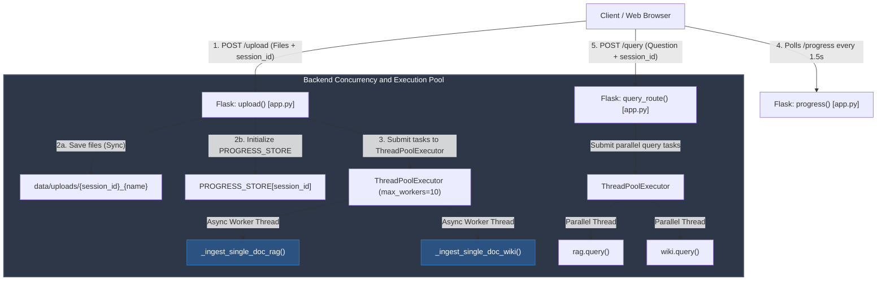
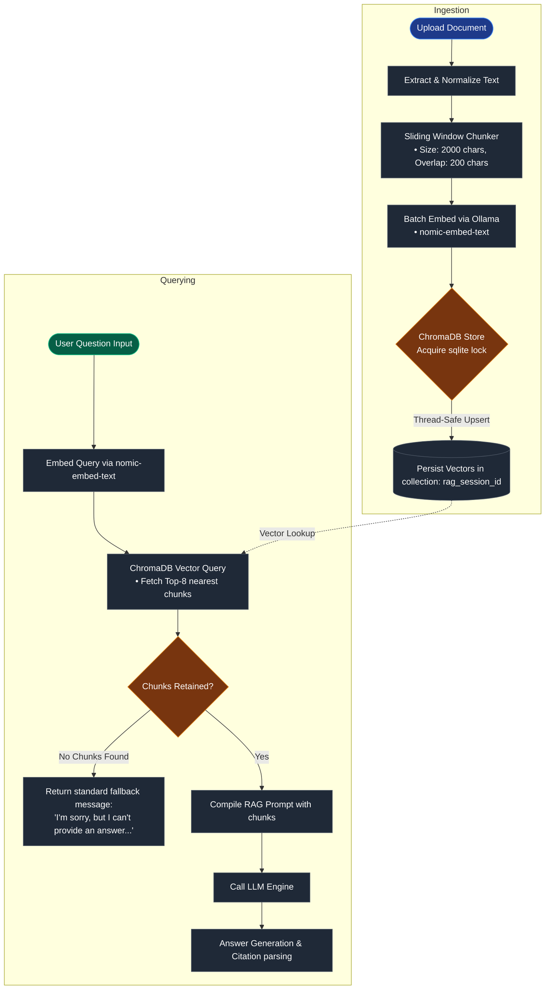
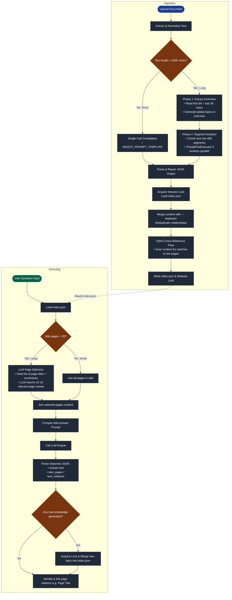

# System Overview: RAG vs LLM Wiki

This application is a research tool designed to compare two distinct paradigms of working with large-scale document knowledge: **Retrieval-Augmented Generation (RAG)** and **LLM Wiki Synthesis**. It is optimized for batch ingestion of up to 50+ documents at once.

## 1. High-Level Architecture

The system is built as a **Single-Page Flask Application**:
- **Backend**: Python/Flask utilizing a `ThreadPoolExecutor` (up to 10 workers) for parallel file ingestion and query processing. Uploads are **non-blocking** — the server accepts files and returns immediately while ingestion runs in background threads.
- **Frontend**: Bootstrap 5 (Dark Mode), Vanilla JS, and D3.js for knowledge graph visualization. Features document-level progress bars with ETA, a responsive side-by-side layout, and a wiki page browser.
- **LLM Engine**: Dual-provider support (Ollama for local embeddings, OpenRouter for cloud LLM reasoning).

### Concurrency & Routing Flow



---

## 2. Pipeline 1: RAG (Retrieval-Augmented Generation)

RAG treats documents as a **searchable database** of raw fragments.

### Ingest Phase
1. **Extraction**: Reads `.pdf` (via `pypdf`) or `.txt` files.
2. **Chunking**: Splits text into 2000-character windows with a 200-character overlap.
3. **Batch Embedding**: Generates vector representations for all chunks in a single API call using local **Ollama** (`nomic-embed-text`) batch embedding.
4. **Storage**: Persists vectors and metadata in **ChromaDB** collections (scoped per session). All writes are synchronized using a global re-entrant lock (`threading.RLock`) to ensure SQLite thread safety when multiple documents ingest concurrently.

### Query Phase
1. **Retrieval**: Embeds the user's question and performs a vector similarity search (top-8 results by default, configurable via `TOP_K` in `.env`). Bypasses the LLM and immediately returns a standard fallback answer (`"I’m sorry, but I can’t provide an answer based on the excerpts you requested."`) if no chunks exist.
2. **Augmentation**: Injects the raw text fragments into a specialized prompt.
3. **Generation**: The LLM answers based *only* on the retrieved context, citing specific chunks. If the retrieved context does not contain the answer, the LLM is strictly instructed to return the fallback statement exactly: `"I’m sorry, but I can’t provide an answer based on the excerpts you requested."`

### RAG Pipeline Flowchart




---


## 3. Pipeline 2: LLM Wiki Synthesis

The Wiki pipeline treats documents as a **source for narrative synthesis**, not entity extraction. The goal is to build wiki pages that explain what provisions *mean* and how they *interact*, not just list facts.

### Ingest Phase (The "Compiler")

The system uses **adaptive segmentation** based on document length:

**Short documents (≤ 100K chars):**
1. The full document is sent in a **single LLM call** with a legal-synthesis-oriented prompt.
2. The LLM produces wiki pages with detailed content and one-line summaries, plus inter-page relations.

**Long documents (> 100K chars) — Two-Phase Approach:**
1. **Phase 1 — Overview**: The first 6K and last 3K characters are sent to the LLM to extract a document overview page and a list of key topics/concepts.
2. **Phase 2 — Detail**: Detailed segments of **40K characters** are sent with the Phase 1 topic list as context. To optimize speed, these segments are processed **concurrently** using a thread pool (`ThreadPoolExecutor` with 5 workers) rather than sequentially.
3. **Strict Quality Instructions**: The prompts are tuned specifically for legal documents, enforcing:
   - **Source Integrity**: Explicitly passing `{doc_name}` and requiring that only citations present in the text be used.
   - **Factual Precision**: Mandating exact verbatim figures and dates, forbidding hallucination.
   - **Legal Depth**: Instructing the extraction of precedents, statutory provisions, and judicial reasoning (ratio decidendi).

**Merge & Persistence:**
- **New Pages**: Added to the index with content and a one-line summary.
- **Existing Pages**: Content is appended with a separator (`---`). Contradictions are flagged.
- **Cross-Referencing**: Automatic pass to detect mentions of page titles within other pages.
- **Thread Safety**: Per-session `threading.Lock` protects the load→merge→save cycle, preventing data loss during parallel multi-document ingestion.
- **Storage**: The wiki is stored as a structured `index.json` per session, where each page contains both full `content` and a `summary` field.

### Query Phase — Index-Based Retrieval

To prevent hallucination at scale (50 documents can produce 300-1500 wiki pages), the query uses a **two-step retrieval** approach:

1. **Page Selection**: The LLM receives only the **list of page titles + one-line summaries** (compact — even 500 pages fits easily). It selects the 10-15 most relevant pages for the question.
2. **Deep Answer**: Only the selected pages' full content is sent in the answer prompt, keeping the context focused and grounded.
3. **Dynamic Learning**: If the answer introduces new concepts or insights, the LLM extracts them into new pages and relations, compounding the wiki's knowledge.
4. **Citation**: Answers use `[Page Title]` notation which links directly to the visual graph.
5. **Graph Rendering**: D3.js renders the `index.json` as a force-directed graph where nodes are entities and edges are relationships.

> For small wikis (≤ 20 pages), the selection step is skipped and all pages are sent directly.

### LLM Wiki Pipeline Flowchart



---


## 4. Upload & Progress System

The upload route is **non-blocking**:
1. Files are saved to disk and ingestion tasks are submitted to the thread pool.
2. The server returns immediately with `{"status": "accepted", "files_queued": N}`.
3. The frontend polls `/progress` every 1.5 seconds, receiving document-level counters:
   ```json
   {"phase": "processing", "docs": {"total": 50, "rag_done": 12, "wiki_done": 8}}
   ```
4. Progress bars show `RAG: 12/50 docs | Wiki: 8/50 docs` with an ETA based on average per-document processing time.
5. When all documents complete both pipelines, `phase` transitions to `"complete"` and the UI enables querying.


## 5. Key Comparisons

| Feature | RAG | LLM Wiki |
| :--- | :--- | :--- |
| **Data Unit** | Raw Chunks (Fixed Size) | Semantic Pages (Narrative Synthesis) |
| **Logic** | Find similar text at query time | Build structured model at ingest time |
| **Ingest Strategy** | Chunk → batch embed → thread-safe store | Adaptive: single-call (≤100K) or two-phase (overview → parallel detail 40K segments) |
| **Query Strategy** | Vector similarity (top-8 chunks) | Index-based: select relevant pages by summary, then deep read |
| **Visuals** | List of retrieved snippets with similarity scores | Interactive D3.js Knowledge Graph & Page Browser |
| **Conflict Handling** | Standalone snippets; fallback if not found | Merges with `---` separators, flags contradictions |
| **Strengths** | Faster ingest, exact retrieval, zero-hallucination fallback | Deep legal synthesis, relationship mapping, dynamic knowledge growth |
| **Scale Behavior** | Handles 50+ docs via batch embedding and locked SQLite writes | Handles 50+ docs via index-based retrieval & parallel segment processing |

---

## 6. Technical Specifications

- **Embeddings**: `nomic-embed-text` (Local via Ollama, batch API)
- **LLM**: `openai/gpt-oss-120b:free` (OpenRouter) or local Ollama fallback
- **Vector DB**: ChromaDB (Persistent at `app/data/chroma`, protected by a global `threading.RLock`)
- **Graphing**: D3.js Force Simulation
- **Isolation**: `session_id` used for per-user database and wiki isolation
- **Concurrency**: `ThreadPoolExecutor(10)` for parallel document ingestion + per-session `threading.Lock` for wiki index safety. In addition, uses nested `ThreadPoolExecutor(5)` for concurrent segment compilation inside `wiki.py` and a global re-entrant lock for thread-safe SQLite writes in `rag.py`.
- **Security**: Split OpenRouter API keys for RAG and Wiki pipelines to monitor quota/usage independently
- **Configurables** (via `.env`):
  - `TOP_K` — number of chunks to retrieve for RAG queries (default: 8)
  - `LLM_PROVIDER` — `openrouter` or `ollama`
  - `OPENROUTER_MODEL` — model to use for LLM calls
  - `PORT` — server port (default: 5001)
