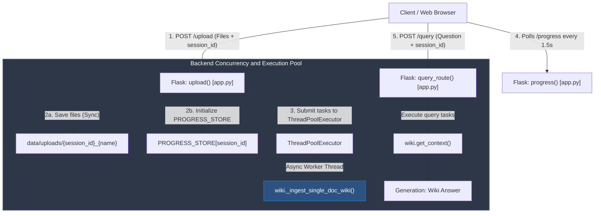
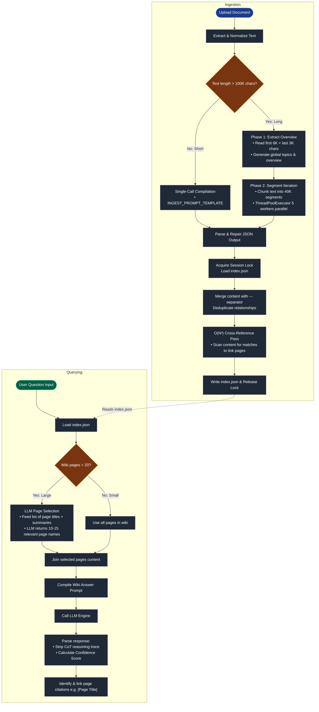

# System Overview: Legal LLM Wiki

This application is a research and knowledge management tool designed to process large-scale legal documents using an **LLM Wiki Synthesis** approach. It is optimized for batch ingestion of up to 50+ documents (including nested folders) at once, extracting deep semantic relationships and generating a navigable knowledge graph.

## 1. High-Level Architecture

The system is built as a **Single-Page Flask Application**:
- **Backend**: Python/Flask utilizing a `ThreadPoolExecutor` for parallel file ingestion and query processing. Uploads are **non-blocking** — the server accepts files and returns immediately while ingestion runs in background threads. Features persistent session management with automatic naming.
- **Frontend**: Bootstrap 5 (Dark Mode), Vanilla JS, and D3.js for knowledge graph visualization. Features document-level progress bars with ETA, a centralized Wiki response view, a wiki page browser, and a file tree viewer for nested uploads.
- **LLM Engine**: Azure OpenAI (or equivalent provider) handles narrative synthesis, legal extraction, and query answering.

### Concurrency & Routing Flow

---

## 2. The Core Pipeline: LLM Wiki Synthesis

The Wiki pipeline treats documents as a **source for narrative synthesis**. The goal is to build wiki pages that explain what legal provisions *mean* and how they *interact*, rather than just retrieving raw text chunks.

### Ingest Phase (The "Compiler")

The system uses **adaptive segmentation** based on document length:

**Short documents (≤ 100K chars):**
1. The full document is sent in a **single LLM call** with a legal-synthesis-oriented prompt.
2. The LLM produces wiki pages with detailed content and one-line summaries, plus inter-page relations.

**Long documents (> 100K chars) — Two-Phase Approach:**
1. **Phase 1 — Overview**: The first 6K and last 3K characters are sent to the LLM to extract a document overview page and a list of key topics/concepts.
2. **Phase 2 — Detail**: Detailed segments of **40K characters** are sent with the Phase 1 topic list as context. To optimize speed, these segments are processed **concurrently** using a thread pool (`ThreadPoolExecutor` with 5 workers) rather than sequentially.
3. **Strict Quality Instructions**: The prompts are tuned specifically for legal documents, enforcing:
   - **Source Integrity**: Explicitly passing `{doc_name}` and requiring that only citations present in the text be used.
   - **Factual Precision**: Mandating exact verbatim figures and dates, forbidding hallucination.
   - **Legal Depth**: Instructing the extraction of precedents, statutory provisions, and judicial reasoning (ratio decidendi).

**JSON Parsing & Repair:**
- Employs robust JSON extraction (`_parse_json_safe`) and an automatic fallback repair mechanism (`_repair_json`) that asks the LLM to fix malformed JSON if parsing fails.

**Merge & Persistence:**
- **New Pages**: Added to the index with content and a one-line summary (`{"title": {"content": "...", "summary": "..."}}`).
- **Existing Pages**: Content is appended with a separator (`---`). Contradictions are flagged.
- **Cross-Referencing**: Automatic pass to detect mentions of page titles within other pages.
- **Thread Safety**: Per-session `threading.Lock` protects the load→merge→save cycle, preventing data loss during parallel multi-document ingestion.
- **Storage**: The wiki is stored as a structured `index.json` per session.

### Query Phase — Index-Based Retrieval

To prevent hallucination at scale, the query uses a **two-step retrieval** approach:

1. **Page Selection**: The LLM receives only the **list of page titles + one-line summaries** (compact — even 500 pages fits easily). It selects the 10-15 most relevant pages for the question.
2. **Deep Answer**: Only the selected pages' full content is sent in the answer prompt, keeping the context focused and grounded.
3. **Chain of Thought & Grounding**: The LLM first generates a `<reasoning>` trace to verify facts against the context, and uses strict inline citations to ensure no hallucination. It also evaluates its own confidence score.
4. **Graph Rendering**: D3.js renders the `index.json` as a force-directed graph where nodes are entities and edges are relationships. The UI displays cited pages dynamically.

> For small wikis (≤ 20 pages), the selection step is skipped and all pages are sent directly.

### LLM Wiki Pipeline Flowchart

---

## 3. Upload, Progress, and Session System

**Uploads**:
The upload route is **non-blocking** and supports nested folders:
1. Files are saved to disk (preserving relative paths via frontend `relative_paths` array) and ingestion tasks are submitted to the thread pool.
2. The server returns immediately with `{"status": "accepted", "files_queued": N}`.
3. The frontend polls `/progress` every 1.5 seconds, receiving document-level counters.
4. When all documents complete processing, `phase` transitions to `"complete"` and the UI enables querying.

**Sessions**:
- The application supports multiple persistent sessions (`data/sessions.json`).
- Sessions are automatically renamed based on the first question asked (first 30 characters).
- Full session CRUD is supported, including clearing all Wiki index data per session.

---

## 4. Technical Specifications

- **LLM**: Azure OpenAI integration configured via `config.py`
- **Graphing**: D3.js Force Simulation
- **Isolation**: `session_id` used for per-user database and wiki isolation
- **Concurrency**: `ThreadPoolExecutor` for parallel document ingestion + per-session `threading.Lock` for wiki index safety. Uses nested `ThreadPoolExecutor(5)` for concurrent segment compilation inside `wiki.py`.
- **Configurables** (via `.env`):
  - `AZURE_OPENAI_API_KEY` — Azure API key
  - `AZURE_OPENAI_ENDPOINT` — Azure Endpoint
  - `AZURE_OPENAI_API_VERSION` — Azure API version
  - `AZURE_OPENAI_DEPLOYMENT` — Deployment name
  - `PORT` — server port (default: 5001)
