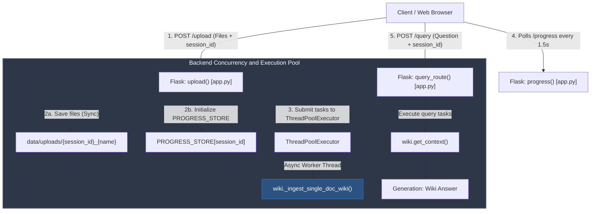
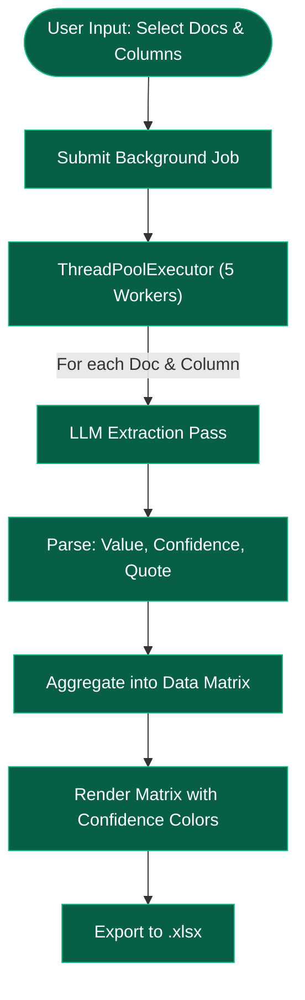
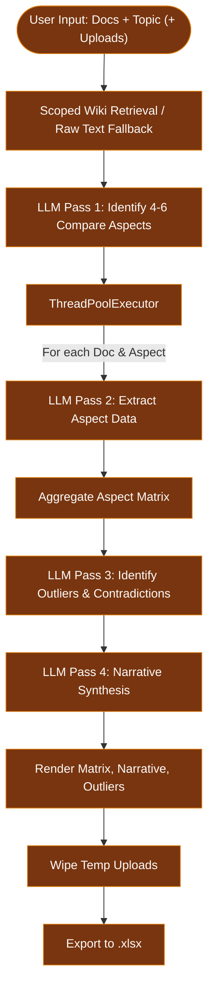
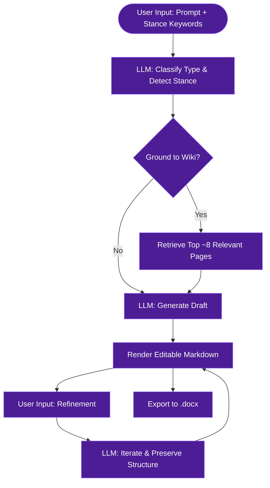
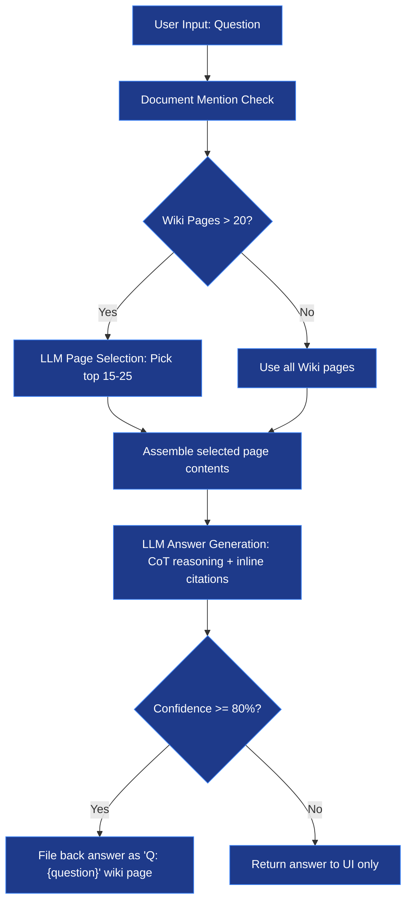
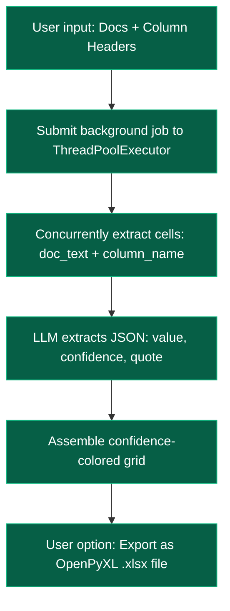
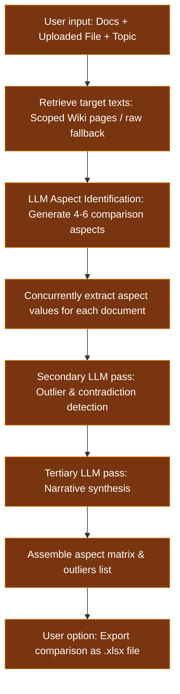
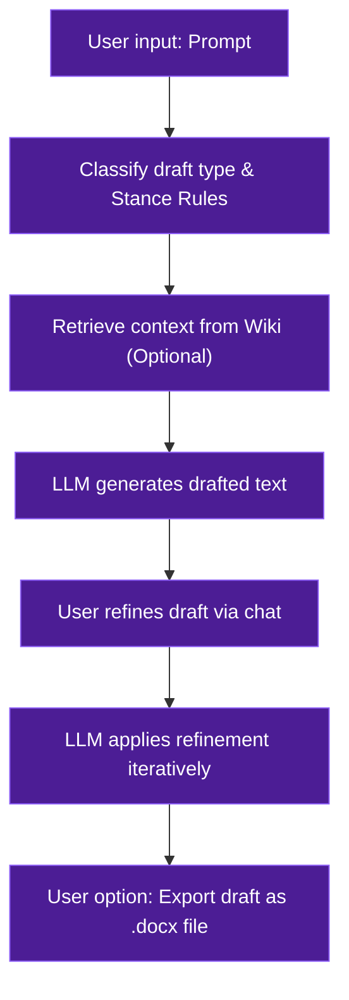

# System Overview: Legal LLM Wiki

This application is a research and knowledge management tool designed to process large-scale legal documents using an **LLM Wiki Synthesis** approach. It is optimized for batch ingestion of up to 50+ documents (including nested folders) at once, extracting deep semantic relationships and generating a navigable knowledge graph.

## 1. High-Level Architecture

The system is built as a **Single-Page Flask Application**:
- **Backend**: Python/Flask utilizing a `ThreadPoolExecutor` for parallel file ingestion and query processing. Uploads are **non-blocking** — the server accepts files and returns immediately while ingestion runs in background threads. Features persistent session management with automatic naming.
  > [!NOTE]
  > While the codebase includes services for raw semantic search/vector retrieval (`rag.py` and `hybrid.py`), these pipelines are currently deactivated (commented out) in the main API server (`app.py`). All document queries and analytics run exclusively through the **LLM Wiki Synthesis** engine.
- **Frontend**: Bootstrap 5 (Light Mode), Vanilla JS, and D3.js for knowledge graph visualization. Features document-level progress bars with ETA, a centralized Wiki response view, a wiki page browser, and a file tree viewer for nested uploads.
- **LLM Engine**: Configurable to use either Azure OpenAI or OpenRouter for narrative synthesis, legal extraction, and query answering.

### Concurrency & Routing Flow

---

## 2. The Core Pipeline: LLM Wiki Synthesis

The Wiki pipeline treats documents as a **source for narrative synthesis**. The goal is to build wiki pages that explain what legal provisions *mean* and how they *interact*, rather than just retrieving raw text chunks.

### Ingest Phase (The "Compiler")

The system uses **adaptive segmentation** based on document length:

**Short documents (≤ 100K chars):**
1. The full document is sent in a **single LLM call** with a legal-synthesis-oriented prompt.
2. The LLM produces wiki pages with detailed content and one-line summaries, plus inter-page relations.

**Long documents (> 100K chars) — Two-Phase Approach:**
1. **Phase 1 — Overview**: The first 6K and last 3K characters are sent to the LLM to extract a document overview page and a list of key topics/concepts.
2. **Phase 2 — Detail**: Detailed segments of **40K characters** are sent with the Phase 1 topic list as context. To optimize speed, these segments are processed **concurrently** using a thread pool (`ThreadPoolExecutor` with 5 workers) rather than sequentially.
3. **Strict Quality Instructions**: The prompts are tuned specifically for legal documents, enforcing:
   - **Source Integrity**: Explicitly passing `{doc_name}` and requiring that only citations present in the text be used.
   - **Factual Precision**: Mandating exact verbatim figures and dates, forbidding hallucination.
   - **Legal Depth**: Instructing the extraction of precedents, statutory provisions, and judicial reasoning (ratio decidendi).

**JSON Parsing & Repair:**
- Employs robust JSON extraction (`_parse_json_safe`) and an automatic fallback repair mechanism (`_repair_json`) that asks the LLM to fix malformed JSON if parsing fails.

**Merge & Persistence:**
- **New Pages**: Added to the index with content and a one-line summary (`{"title": {"content": "...", "summary": "...", "source_doc": "..."}}`).
- **Existing Pages**: Content is appended with a separator (`---`). 
- **Contradiction Detection**: Pre-flight checks on long appending segments (`>200 chars`) trigger a micro-LLM pass (`max_tokens=300`) using the **fast/cheap model** — this is a structured boolean JSON check, not synthesis. Found factual contradictions push the page into a `contradiction_flagged` state and populate a `variants` array to track the document lineage of the conflicting values.
- **Cross-Referencing**: Automatic pass to detect mentions of page titles within other pages.
- **Thread Safety**: Per-session `threading.Lock` protects the load→merge→save cycle, preventing data loss during parallel multi-document ingestion. A separate `_log_locks` dict safeguards concurrent writes to a timestamped `log.md` file.
- **Storage**: The wiki is stored as a structured `index.json` per session.

### Query Phase — Index-Based Retrieval

To prevent hallucination at scale, the query uses a **two-step retrieval** approach:

1. **Document Mention Check**: Scans the user query string for mentions of any document names. If file mentions are detected, all wiki pages containing those filenames are marked as forced selections.
2. **Page Selection**: If the wiki grows beyond 20 pages, the **fast/cheap model** receives the list of page titles + one-line summaries and selects the 15-25 most relevant pages. Title matching does not require legal reasoning depth, so the cheap model is used here to reduce cost.
3. **Deep Answer**: Only the selected pages' full content is sent to the **full synthesis model** in the answer prompt, prepending a `[WARNING]` tag to any page flagged for contradictions.
4. **Chain of Thought, Grounding & Confidence**: The LLM generates a `<reasoning>` trace to verify facts against the context, ending with a self-assessed `CONFIDENCE_SCORE` (0–100) and `CONFIDENCE_REASON`. Confidence is extracted from the reasoning block via regex — **no second LLM call is made**. This halves query-time LLM cost compared to a separate confidence-evaluation round-trip.
5. **Answer Filing**: Answers scoring `>= 80` confidence are automatically filed back into the wiki as a `"Q: {question}"` page for future compound learning. An anti-duplication title check ensures similar questions append to existing pages rather than fragmenting the wiki.
6. **Graph Rendering**: D3.js renders the `index.json` as a force-directed graph where nodes are entities and edges are relationships.

---

## 3. Advanced Modes (Review, Compare, & Draft)

To supplement standard querying, three advanced analytical modes operate independently of the ingest pipeline.

### Review Mode
Designed for bulk data extraction across documents.
- **Workflow**: User selects multiple documents and defines arbitrary column headers.
- **Concurrency**: A background `ThreadPoolExecutor` spins up 5 workers, concurrently querying every (document, column) combination using **wiki-synthesized content** (falling back to raw document text if the document has not been ingested).
- **Export**: Generates a confidence-colored `.xlsx` matrix (green for high confidence, yellow for medium, red/flagged for low or null), built using `openpyxl`.

### Compare Mode
Designed for deep, aspect-oriented comparison between existing knowledge and new unstructured uploads.
- **Retrieval**: Uses scoped lookup to retrieve wiki content specifically tagged with the requested `source_doc`. If a selected document has no wiki pages, it automatically falls back to raw text extraction.
- **Aspect Identification**: A single LLM pass generates 4-6 specific aspects to compare based on the user's topic.
- **Extraction & Outliers**: Extracts the values concurrently across documents, then runs a secondary LLM pass to explicitly identify contradictions and generate a narrative synthesis. Temporary uploaded files are strictly wiped after the job completes to preserve storage.

### Draft Mode
Designed for ephemeral, context-aware legal drafting with automatic stance detection.
- **Stance & Classification**: Analyzes the user's prompt to detect the desired negotiating stance (e.g., `tata_favorable`, `counterparty_favorable`, `neutral`) and classifies the request type (e.g., `clause`, `full_document`, `letter`).
- **Wiki Grounding**: Optionally retrieves up to 8 relevant wiki pages as drafting precedent (`get_draft_context`) or operates in a standalone mode.
- **Generation & Refinement**: Generates the initial draft and allows the user to submit refinement instructions (e.g., "make this more aggressive") which iterates on the draft while preserving existing structure.
- **Export**: Converts the markdown draft, including tables and formatting, into a downloadable `.docx` file using `python-docx`.
### Detailed Flowchart: Review and Compare Modes

#### Review Mode Flow

#### Compare Mode Flow

#### Draft Mode Flow

### Execution Flow of System Modes

#### Ask Mode (Standard Query)

#### Review Mode (Bulk Extraction)

#### Compare Mode (Deep Comparison)

#### Draft Mode (Context-Aware Drafting)

### LLM Wiki Pipeline Flowchart

---

## 4. Upload, Progress, and Session System

**Uploads**:
The upload route is **non-blocking** and supports nested folders:
1. Files are saved to disk (preserving relative paths via frontend `relative_paths` array) and ingestion tasks are submitted to the thread pool.
2. The server returns immediately with `{"status": "accepted", "files_queued": N}`.
3. The frontend polls `/progress` every 1.5 seconds, receiving document-level counters.
4. When all documents complete processing, `phase` transitions to `"complete"` and the UI enables querying.

**Sessions & Isolation**:
- The application supports multiple persistent sessions (`data/sessions.json`).
- Sessions are automatically renamed based on the first question asked (first 30 characters).
- **Strict Isolation**: Every chat session maintains its own completely independent `index.json` and `UPLOAD_PATH`. Knowledge is strictly sandboxed per session to prevent cross-contamination.
- **Context-Aware UI**: Advanced UI modes (`[Ask]`, `[Compare]`, `[Review]`) dynamically appear only within an active session (after upload completion or when resuming an older session), ensuring a clean, context-focused workspace.
- Full session CRUD is supported, including clearing all Wiki index data per session.

---

## 5. UI Architecture (Light-Mode SPA)

The frontend is a custom-built, lightweight Single-Page Application (SPA) designed to feel like a premium analytical tool.
- **Technology Stack**: HTML5, Vanilla JavaScript, and minimal Bootstrap 5 (only used for structural grids).
- **Aesthetics**: Complete departure from dark-mode; utilizes a clean Light Theme defined by custom CSS variables (`--bg-surface`, `--accent`, etc.) and Google Fonts (`Lora` and `DM Sans`).
- **Layout**: Three fixed zones (Topbar, Sidebar, Main Workspace) with no page reloads. Modals (Doc Reader, Knowledge Graph) are implemented as absolute-positioned overlays.
---

## 6. Technical Specifications

- **LLM & Embeddings**: Supports both Azure OpenAI and OpenRouter configuration (via `config.py`).
- **Dual-Model Routing**: Uses a large model for synthesis-heavy tasks (ingest compilation, answer generation, drafting, compare narrative) and a fast/cheap model for lightweight structured tasks (page selection, contradiction pre-flight, JSON repair, cell extraction). Routing is handled in `llm.py` via the `fast=True` flag — no code changes needed to swap models, only `.env` updates.
- **Token Budgets**: All LLM calls have explicit `max_tokens` caps defined as constants in `config.py` (`MAX_TOKENS_*`). This prevents silently burning token budget on calls whose outputs are small JSON objects.
- **Graphing**: D3.js Force Simulation for navigable knowledge graph.
- **Isolation**: `session_id` used for per-user database and wiki isolation.
- **Concurrency**: `ThreadPoolExecutor` for parallel document ingestion + per-session `threading.Lock` for wiki index safety. Uses nested `ThreadPoolExecutor` (concurrency limited by `WIKI_MAX_WORKERS` from config, default: 3) for concurrent segment compilation inside `wiki.py`.
- **Configurables** (via `.env`):
  - `LLM_PROVIDER` — Provider for LLM calls (`azure` or `openrouter`, default: `azure`)
  - `EMBEDDING_PROVIDER` — Provider for embedding generation (`azure` or `openrouter`, default: `azure`)
  - `AZURE_OPENAI_API_KEY` — Azure API key
  - `AZURE_OPENAI_ENDPOINT` — Azure Endpoint URL
  - `AZURE_OPENAI_API_VERSION` — Azure API version
  - `AZURE_OPENAI_DEPLOYMENT` — **Big model** deployment for synthesis tasks (e.g. `gpt-5.4`)
  - `AZURE_FAST_DEPLOYMENT` — **Fast/cheap model** deployment for selection, contradiction checks, repair (e.g. `gpt-5.4-mini`)
  - `AZURE_OPENAI_EMBEDDING_DEPLOYMENT` — Deployment name for Azure embeddings (e.g. `text-embedding-3-large`)
  - `EMBEDDING_DIMENSIONS` — Embedding dimensions (default: `1536`)
  - `OPENROUTER_API_KEY` — OpenRouter API key
  - `OPENROUTER_MODEL` — **Big model** for synthesis tasks (e.g. `openai/gpt-oss-120b:free`)
  - `OPENROUTER_FAST_MODEL` — **Fast/cheap model** for selection, contradiction checks, repair (e.g. `openai/gpt-oss-20b:free`)
  - `OPENROUTER_EMBEDDING_MODEL` — OpenRouter embedding model name (e.g. `nvidia/llama-nemotron-embed-vl-1b-v2:free`)
  - `WIKI_MAX_WORKERS` — Thread workers for concurrent chunk processing (default: `3`)
  - `TESSERACT_CMD` — Path to Tesseract executable (for OCR fallback on scanned PDFs)
  - `PORT` — server port (default: 5001)

